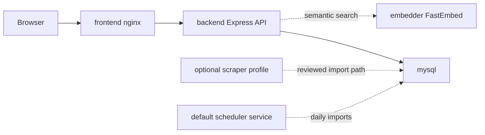

# ElonMealsDB

ElonMealsDB is a full stack dining planner I built around a MySQL database and scraper I built in undergrad. It webscrapes Elon Dining menu data, imports it into a relational model, and turns it into a React dashboard for searching foods, comparing stations, checking nutrition, and planning a meal.

All input data stays in the user's browser: favorites, selected foods, nutrition goals, and safety preferences are stored locally instead of requiring accounts or logging records because not every service needs to require signup. The backend is read only for all web traffic and focuses on menu data, search, and coverage metrics. Imports are automatically run using the Docker version of a cronjob. This is done both to not spam Elon Dining's website, as well to consistently collect data so there is no downtime.

This is an independent portfolio project. It is not affiliated with, endorsed by, or sponsored by Elon University. Users should verify current dining information with the official dining provider, especially for allergen or medical decisions.

## Quick Start

```bash
cp .env.example .env
# Edit .env and replace every change-me password before publishing.
docker compose up --build
```

Open `http://localhost:8080`.

The frontend is bound to `127.0.0.1:8080` by default so it is ready to sit behind a local HTTPS reverse proxy I.E. Caddy.

Run the scraper import below to refresh MySQL with live Elon Dining data.


Mobile view:


Useful checks:

```bash
curl http://localhost:8080/healthz
curl http://localhost:8080/api/health
curl "http://localhost:8080/api/restaurants?date=2026-07-01"
```

## Stack

- Frontend: React, Vite, TypeScript
- Backend: Node.js, Express, `mysql2/promise`, Zod, Helmet
- Database: MySQL
- Scraper/search: Python using beautifulsoup4, requests, and PyMySQL
- Deployment: Docker Compose
- DB privilege model: read only API user plus separate limited scraper writer user

## Architecture



See [docs/architecture.md](docs/architecture.md) for the system design, [docs/sql-walkthrough.md](docs/sql-walkthrough.md) for runnable SQL examples, [docs/demo-walkthrough.md](docs/demo-walkthrough.md) for a short demo path, and [docs/portfolio-case-study.md](docs/portfolio-case-study.md) for project notes.

## SQL

To be a fully fledged project, this needed a real database as there are almost exclusively one-to-many any many-to-many relationships. The app uses SQL for the parts where a relational database actually makes sense:

- Restaurant -> meal -> station -> food hierarchy joins.
- Many-to-many station food appearances, so the same food can show up in different places without duplicating nutrition facts.
- Dietary and allergen filtering with validated request parameters.
- Station-level aggregates for average calories, protein, and safe-option counts.
- Nutrition rankings such as protein per 100 calories and high-sodium outliers.
- Import audit trails through `scraper_runs`, so freshness is queryable instead of just implied by logs.

The SQL examples in [docs/sql-walkthrough.md](docs/sql-walkthrough.md) can be run against the local Docker database, and `/api/sql-proof` exposes fixed example queries for a quick code review.

## Interesting Features

I like to try new technologies as well as refresh myself on old ones. So, despite being a small project, it has this added copmlexity.

- Relational design for restaurants, meals, stations, foods, and scraper run metadata.
- SQL joins, aggregates, station-level nutrition comparison, nutrition ranking, and import audit trails across the full menu hierarchy.
- Secure API defaults: request validation, rate limits, parameterized queries, structured errors, no stack traces in responses.
- Docker-first deployment with private DB networking
- A frontend that works like an app: imported-date browsing, local favorites, a dated meal planner, station comparison, nutrition insights, CSV export, responsive tables, and a detail drawer.
- React frontend with feature-oriented modules for timeline, planner, menu controls, food views, insights, panels, shared utilities, and scoped stylesheet sections.

## Self-Hosting

I self-host the app as Docker containers behind Caddy and a Cloudflare Tunnel.

## Scraper Imports

The scraper is an explicit private job, not a public web action. Run a one-shot import for today and tomorrow:

```bash
docker compose --profile scraper run --rm scraper
```

The recurring scheduler starts with the normal Compose stack.

```bash
docker compose up -d --build
```

By default it imports once at container startup, then imports today and tomorrow at `05:15` and `15:15` EST

The scheduler records failed import attempts in `scraper_runs` and keeps running, so transient Elon Dining or network issues do not permanently stop future scheduled imports.

Check the current scheduler state:

```bash
docker compose logs --tail=80 scraper-scheduler
docker compose ps scraper-scheduler
```

Refresh semantic search vectors for an already imported date:

```bash
docker compose --profile scraper run --rm scraper python -m elon_scraper.cli refresh-embeddings --date 2026-07-01
```

For local parser development:

```bash
python -m pip install -r scraper/requirements-dev.txt
pytest scraper/tests
python -m elon_scraper.cli collect --date 2026-07-01 --max-restaurants 1
python -m elon_scraper.cli import-db --date 2026-07-01
```

## Development

```bash
npm install
python -m pip install -r scraper/requirements-dev.txt
npx playwright install chromium
npm run typecheck
npm test
npm run test:e2e
npm run build
```

Run the backend and frontend separately during UI work:

```bash
npm --workspace @elon-meals-db/backend run dev
npm --workspace @elon-meals-db/frontend run dev
```

## License

MIT. See [LICENSE](LICENSE).
