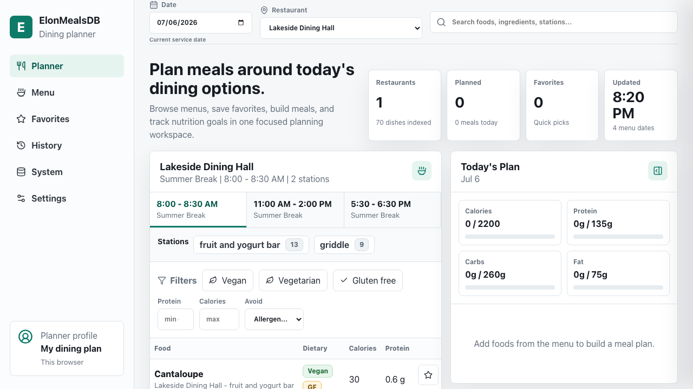
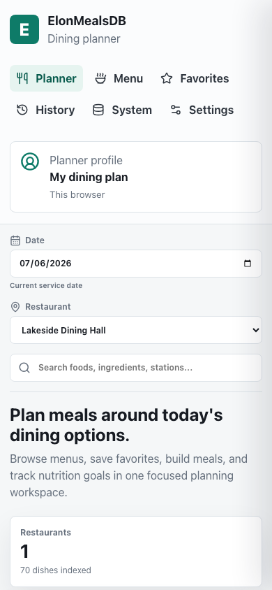
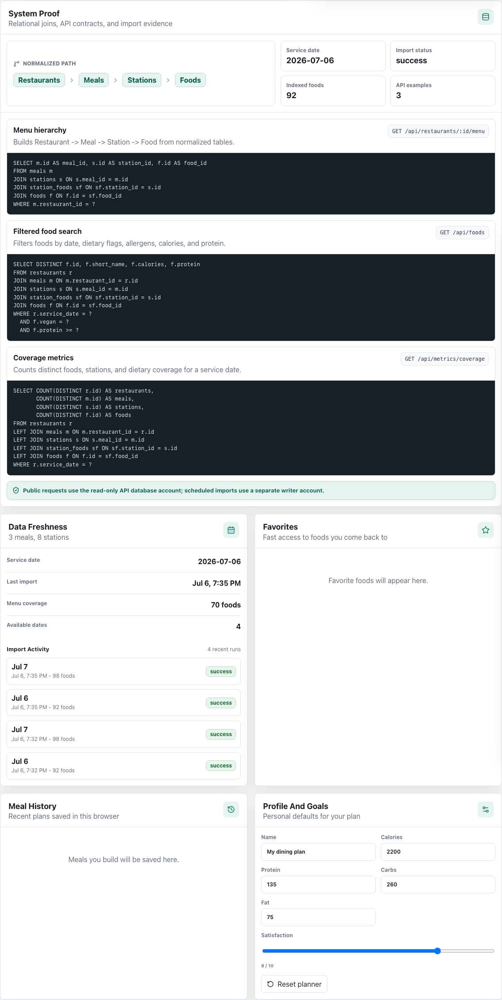
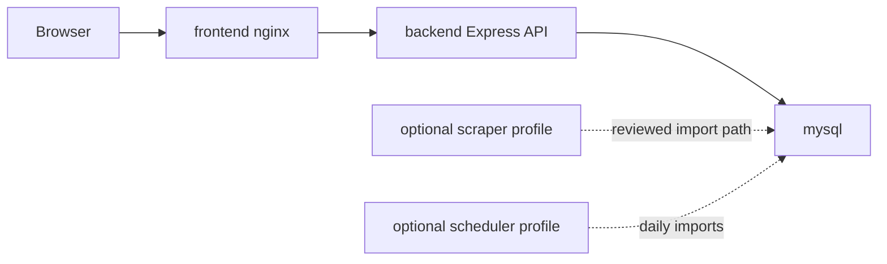

# ElonMealsDB

ElonMealsDB is a Dockerized campus dining planner for exploring Elon Dining menus with a relational MySQL data model, a secure Express API, an explicit scraper job, and a polished React dashboard.

Personal planning data stays in the user's browser: favorites, meal plans, nutrition goals, and history are stored locally instead of requiring accounts or server-side user records. The backend is intentionally read-only for public traffic and focuses on normalized menu data, search, coverage metrics, and scraper-backed imports run by the operator.

## Quick Start

```bash
cp .env.example .env
# Edit .env and replace every change-me password before publishing.
docker compose up --build
```

Open `http://localhost:8080`.

On first run, the dashboard chooses today's imported menu when available and otherwise falls back to the newest bundled sample date. Run the scraper import below to refresh MySQL with live Elon Dining data.



Mobile view:



SQL and import proof:



Useful checks:

```bash
curl http://localhost:8080/healthz
curl http://localhost:8080/api/health
curl "http://localhost:8080/api/restaurants?date=2026-07-01"
```

## Stack

- Frontend: React, Vite, TypeScript, nginx static container
- Backend: Node.js, Express, `mysql2/promise`, Zod, Helmet
- Database: MySQL 8.4 schema plus deterministic sample menu data
- Scraper: Python CLI parsing current Elon Dining embedded nutrition JSON
- Deployment: Docker Compose behind your own HTTPS reverse proxy
- DB privilege model: read-only API user plus separate limited scraper writer user

## Architecture



See [docs/architecture.md](docs/architecture.md) for the system design, [docs/sql-walkthrough.md](docs/sql-walkthrough.md) for runnable SQL examples, [docs/demo-walkthrough.md](docs/demo-walkthrough.md) for a portfolio-ready demo path, and [docs/portfolio-case-study.md](docs/portfolio-case-study.md) for website-ready project copy.

## What This Shows

- Normalized relational design for restaurants, meals, stations, foods, and scraper run metadata.
- SQL joins, aggregates, nutrition ranking, and import audit trails across the full menu hierarchy.
- Secure API defaults: request validation, rate limits, parameterized queries, structured errors, no stack traces in responses.
- Docker-first deployment with private DB networking and non-root application containers.
- A production-style frontend with local favorites, a dated meal planner, nutrition goals, history, responsive tables, and a detail drawer.

For a short reviewer walkthrough, use [docs/demo-walkthrough.md](docs/demo-walkthrough.md).

For website or resume positioning, use [docs/portfolio-case-study.md](docs/portfolio-case-study.md).

## Scraper Imports

The scraper is an explicit private job, not a public web action. Run a one-shot import for today and tomorrow:

```bash
docker compose --profile scraper run --rm scraper
```

Run the recurring scheduler container. This is the Docker equivalent of a cron job: it travels with the Compose stack, runs privately on the internal network, and uses the scraper database account instead of exposing any public import endpoint.

```bash
docker compose --profile scheduler up -d scraper-scheduler
```

By default it imports today and tomorrow at `05:15` and `15:15` America/New_York time. Adjust `.env` with:

```bash
SCRAPER_RUN_TIMES=05:15,15:15
SCRAPER_DAYS_AHEAD=1
```

The scheduler records failed import attempts in `scraper_runs` and keeps running, so transient Elon Dining or network issues do not permanently stop future scheduled imports. One-shot `import-db` still exits nonzero after recording the failure.

Check the current scheduler state:

```bash
docker compose --profile scheduler logs --tail=80 scraper-scheduler
docker compose --profile scheduler ps
```

For local parser development:

```bash
python -m pip install -r scraper/requirements-dev.txt
PYTHONPATH=scraper pytest scraper/tests
PYTHONPATH=scraper python -m elon_scraper.cli collect --date 2026-07-01 --max-restaurants 1
PYTHONPATH=scraper DB_HOST=127.0.0.1 DB_NAME=elon_meals DB_USER=elon_scraper DB_PASSWORD=... python -m elon_scraper.cli import-db --date 2026-07-01
```

If you change database usernames/passwords after a Docker volume already exists, re-apply grants without wiping data:

```bash
docker compose exec -T mysql sh -c '/docker-entrypoint-initdb.d/003_least_privilege_users.sh'
```

## Development

```bash
npm install
python -m pip install -r scraper/requirements-dev.txt
npx playwright install chromium
npm run typecheck
npm test
npm run test:e2e
npm run build
```

Full local verification before publishing:

```bash
npm run typecheck
npm test
npm run test:e2e
npm run build
PYTHONPATH=scraper pytest scraper/tests
npm audit --workspaces --omit=dev
pip-audit -r scraper/requirements.txt
docker compose --profile scraper --profile scheduler build
docker compose up -d --wait --wait-timeout 180
curl -fsS http://localhost:8080/healthz
curl -fsS http://localhost:8080/api/service-dates
```

Run the backend and frontend separately during UI work:

```bash
npm --workspace @elon-meals-db/backend run dev
npm --workspace @elon-meals-db/frontend run dev
```

## Security

Read [docs/deployment.md](docs/deployment.md), [docs/security.md](docs/security.md), and the latest [security audit notes](docs/security-audit.md) before self-hosting. In short:

- Put the app behind HTTPS.
- Change the passwords in `.env`.
- Do not expose MySQL publicly.
- Keep the backend on the read-only `MYSQL_API_USER`; only the scraper/scheduler should use the writer account.
- Do not expose the backend directly unless your reverse proxy preserves the intended CORS and rate-limit behavior.
- Keep scraper/import workflows private and operator-triggered.

## API

See [docs/api.md](docs/api.md) for example API calls.
