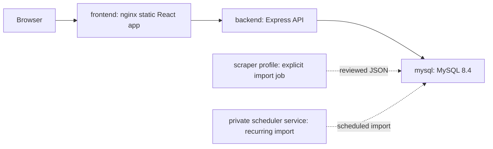
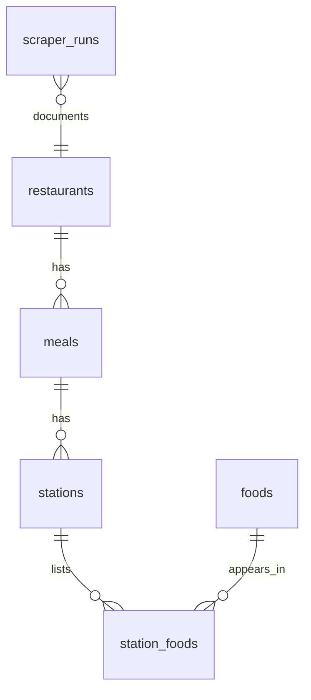

# Architecture

ElonMealsDB is organized as a small Docker Compose system:



The public API serves normalized dining data and metrics. Personal planning state lives in browser storage, so self-hosting does not require accounts, login secrets, or server-side user records. The one-shot scraper is a private Compose profile, and the recurring scheduler is a private default service, so website users cannot trigger external fetches or imports.

## Data Model



Core joins used by the dashboard:

```sql
SELECT r.name AS restaurant,
  m.name AS meal,
  s.name AS station,
  f.short_name AS food,
  f.calories,
  f.protein
FROM restaurants r
JOIN meals m ON m.restaurant_id = r.id
JOIN stations s ON s.meal_id = m.id
JOIN station_foods sf ON sf.station_id = s.id
JOIN foods f ON f.id = sf.food_id
WHERE r.service_date = :serviceDate
ORDER BY r.name, m.time_open, s.name, f.short_name;
```

For a more complete portfolio-oriented SQL walkthrough, see [sql-walkthrough.md](sql-walkthrough.md).

The frontend asks `/api/service-dates` on startup. It selects the current Eastern service date when data has been imported for today, otherwise it falls back to the newest available imported or sample date. This keeps first-run Docker installs usable while still preferring fresh scheduled imports.

## Services

- `frontend`: Vite React app built into static assets and served by nginx with security headers. It proxies `/api` to the backend on the internal Docker network.
- `backend`: Read-only Express API using `mysql2/promise`, Zod validation, Helmet, rate limiting, CORS allowlisting, structured errors, and parameterized SQL. It connects as `MYSQL_API_USER`, which only has `SELECT`/`SHOW VIEW` grants.
- `mysql`: MySQL 8.4 with schema and deterministic sample menu data loaded from `db/init`.
- `scraper`: Optional Python CLI that fetches Elon Dining pages and upserts normalized menu data into MySQL as `MYSQL_SCRAPER_USER`. It is not part of the public request path.
- `scraper-scheduler`: Long-running private scheduler service that runs the same import on configured America/New_York times with the same limited writer account.

Import runs write operational metadata into `scraper_runs`. Successful imports record source URL, target date, counts, and timestamps. Failed scheduled imports also write a `failed` row with an error message and then keep the scheduler alive for the next configured run; one-shot imports still return a nonzero exit after recording the failed run. `scraper_runs.foods_count` tracks food appearances imported across stations and meals, while dashboard coverage metrics use distinct food ids.

## Local Planning State

The app stores the user's profile, favorites, planned meals, quantities, and history in `localStorage` under a versioned key. That keeps the full planning workflow available without introducing a public write API. Clearing browser storage resets only the personal planner state; the menu database remains unchanged.
