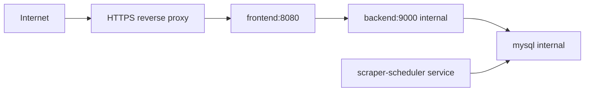

# Production Deployment

ElonMealsDB is intended to run as a Docker Compose stack behind an HTTPS reverse proxy that you control. The included Compose file publishes only the frontend container to the host, and it binds to `127.0.0.1:8080` by default. The backend, MySQL database, scraper, and scheduler stay on the private Compose network.

## Recommended Topology



Use one of:

- Caddy, nginx, Traefik, or Cloudflare Tunnel in front of `127.0.0.1:8080`.
- A private host firewall that allows only `80` and `443` from the internet.
- Docker volumes or host backups for `mysql-data`.

Do not expose:

- MySQL port `3306`.
- Backend port `9000`.
- Scraper or scheduler containers.

## First Deployment

```bash
git clone https://github.com/ChaddBrenner/ElonMealsDB.git
cd ElonMealsDB
cp .env.example .env
```

Before starting the stack, edit `.env`:

```bash
MYSQL_ROOT_PASSWORD=<strong unique password>
MYSQL_API_PASSWORD=<strong unique read-only API password>
MYSQL_SCRAPER_PASSWORD=<strong unique scraper writer password>
CORS_ORIGINS=https://your-domain.example
FRONTEND_BIND=127.0.0.1
FRONTEND_PORT=8080
SCRAPER_RUN_TIMES=05:15,15:15
SCRAPER_DAYS_AHEAD=1
SCRAPER_RUN_ON_START=true
```

Start the public app:

```bash
docker compose up -d --build --wait --wait-timeout 180
```

The scheduled importer starts with the default stack. It runs privately on the internal Compose network and is not reachable from the public frontend.

Check the deployment:

```bash
docker compose ps
curl -fsS http://localhost:8080/healthz
curl -fsS http://localhost:8080/api/ready
curl -fsS http://localhost:8080/api/service-dates
```

## Reverse Proxy Example

Caddy example:

```caddyfile
meals.your-domain.example {
  encode zstd gzip
  reverse_proxy 127.0.0.1:8080
}
```

nginx example:

```nginx
server {
  listen 443 ssl http2;
  server_name meals.your-domain.example;

  ssl_certificate /etc/letsencrypt/live/meals.your-domain.example/fullchain.pem;
  ssl_certificate_key /etc/letsencrypt/live/meals.your-domain.example/privkey.pem;

  location / {
    proxy_pass http://127.0.0.1:8080;
    proxy_set_header Host $host;
    proxy_set_header X-Forwarded-For $proxy_add_x_forwarded_for;
    proxy_set_header X-Forwarded-Proto https;
  }
}
```

The app expects the frontend origin to be the public origin. Set `CORS_ORIGINS` to that exact HTTPS origin.

Keep `FRONTEND_BIND=127.0.0.1` when the reverse proxy runs on the same Docker host. Use a different bind address only when your network topology requires it and the host firewall allows only the intended proxy or private network to reach the port.

## Operating The Scheduler

The scheduler runs inside the Compose network and uses `MYSQL_SCRAPER_USER`.

View logs:

```bash
docker compose logs --tail=120 scraper-scheduler
```

Run an immediate one-shot import:

```bash
docker compose --profile scraper run --rm scraper
```

Change import timing:

```bash
SCRAPER_RUN_TIMES=05:15,15:15
SCRAPER_DAYS_AHEAD=1
SCRAPER_RUN_ON_START=true
```

The schedule is interpreted in `America/New_York`.

## Updates

```bash
git pull --ff-only
docker compose --profile scraper build
docker compose up -d --wait --wait-timeout 180
```

If database usernames or passwords change after the MySQL volume already exists, re-apply grants without wiping data:

```bash
docker compose exec -T mysql sh -c '/docker-entrypoint-initdb.d/003_least_privilege_users.sh'
```

## Backups

Create a logical backup:

```bash
docker compose exec -T mysql sh -c 'MYSQL_PWD="$MYSQL_ROOT_PASSWORD" mysqldump -uroot "$MYSQL_DATABASE"' > elon-meals-backup.sql
```

Restore into an initialized database:

```bash
docker compose exec -T mysql sh -c 'MYSQL_PWD="$MYSQL_ROOT_PASSWORD" mysql -uroot "$MYSQL_DATABASE"' < elon-meals-backup.sql
```

Also back up the Docker named volume if you use host-level backup tooling.

## Public Readiness Checklist

Before making the repo public or linking the deployed app:

```bash
npm run typecheck
npm test
npm run test:e2e
npm run build
PYTHONPATH=scraper .venv/bin/pytest scraper/tests
npm audit --workspaces --omit=dev
.venv/bin/pip-audit -r scraper/requirements.txt
docker compose --profile scraper config --quiet
```

Manual checks:

- Confirm `docker compose ps` shows only the frontend host port, bound to `127.0.0.1:${FRONTEND_PORT:-8080}`.
- Confirm `/api/ready` returns `{"status":"ready","database":true}`.
- Confirm `/api/sql-proof` returns fixed examples.
- Confirm the backend DB user cannot write.
- Confirm the scheduler logs show successful imports or clear recorded failures.
- Confirm the app is reachable only through HTTPS in production.
