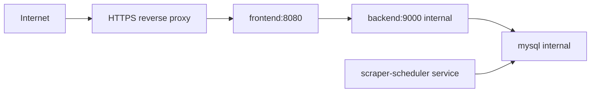

# Deployment And Security

ElonMealsDB is meant to run as a Docker Compose stack behind an HTTPS reverse proxy. The Compose file publishes only the frontend container to the host, loopback-bound at `127.0.0.1:8080` by default. The backend, MySQL database, scraper, and scheduler stay on the private Compose network.

This app imports public dining menu data for a student-facing planning experience. Before running a public deployment, confirm your usage follows the source site's current terms, keep import frequency modest, and keep the app's independent/non-affiliated status clear to users.

## Topology



My hosted copy runs behind Caddy and Cloudflare Tunnel. Cloudflare Tunnel handles the public HTTPS entrypoint, Caddy reverse proxies to the loopback-bound frontend, and the backend/database/import services stay private on the Docker network.

Do not expose:

- MySQL port `3306`.
- Backend port `9000`.
- Scraper or scheduler containers.

## First Run

```bash
git clone https://github.com/ChaddBrenner/ElonMealsDB.git
cd ElonMealsDB
cp .env.example .env
```

Before starting the stack, edit `.env`:

```bash
MYSQL_ROOT_PASSWORD=<strong unique password>
MYSQL_API_PASSWORD=<strong unique read-only API password>
MYSQL_SCRAPER_PASSWORD=<strong unique scraper writer password>
CORS_ORIGINS=https://your-domain.example
FRONTEND_BIND=127.0.0.1
FRONTEND_PORT=8080
SCRAPER_RUN_TIMES=05:15,15:15
SCRAPER_DAYS_AHEAD=1
SCRAPER_RUN_ON_START=true
```

Start the app:

```bash
docker compose up -d --build --wait --wait-timeout 180
```

The scheduled importer starts with the default stack. It runs privately on the internal Compose network and is not reachable from the public frontend.

Check the deployment:

```bash
docker compose ps
curl -fsS http://localhost:8080/healthz
curl -fsS http://localhost:8080/api/ready
curl -fsS http://localhost:8080/api/service-dates
```

## Reverse Proxy

Example Caddyfile:

```caddyfile
meals.your-domain.example {
  encode zstd gzip
  reverse_proxy 127.0.0.1:8080
}
```

Set `CORS_ORIGINS` to the exact public HTTPS origin. Keep `FRONTEND_BIND=127.0.0.1` when the reverse proxy runs on the same Docker host. Use a broader bind only when the host firewall allows only the intended proxy or private network to reach the port.

## Scheduler

The scheduler runs inside the Compose network and uses `MYSQL_SCRAPER_USER`.

View logs:

```bash
docker compose logs --tail=120 scraper-scheduler
```

Run an immediate one-shot import:

```bash
docker compose --profile scraper run --rm scraper
```

Change import timing:

```bash
SCRAPER_RUN_TIMES=05:15,15:15
SCRAPER_DAYS_AHEAD=1
SCRAPER_RUN_ON_START=true
```

The schedule is interpreted in `America/New_York`. Failed scheduled imports are recorded in `scraper_runs`, and the scheduler keeps running for the next configured import.

## Updates

```bash
git pull --ff-only
docker compose --profile scraper build
docker compose up -d --wait --wait-timeout 180 --remove-orphans
```

For existing MySQL volumes, apply new schema migrations before relying on new database-backed features:

```bash
docker compose exec -T mysql sh -c 'MYSQL_PWD="$MYSQL_ROOT_PASSWORD" mysql -uroot "$MYSQL_DATABASE"' < db/migrations/005_nullable_food_unknowns.sql
```

If database usernames or passwords change after the MySQL volume already exists, re-apply grants without wiping data:

```bash
docker compose exec -T mysql sh -c '/docker-entrypoint-initdb.d/003_least_privilege_users.sh'
```

## Security Model

The security goal is narrow and realistic: public users can read menu data, while personal planning state stays in the browser. There are no accounts, uploads, payment forms, admin panels, or public scraper buttons.

The main controls are:

- Public API routes are read-only.
- Zod validates request data at runtime, including dates, IDs, booleans, protein/calorie bounds, search text, and allergen lists.
- API SQL uses `mysql2/promise` placeholders so request values stay separate from SQL text.
- Allergen filters map request values to a fixed server-side column allowlist.
- Helmet adds common browser-facing security headers.
- CORS limits which browser origins are allowed to read API responses.
- Rate limiting slows noisy public traffic.
- The backend connects as `MYSQL_API_USER`, which can read but cannot insert, update, or delete.
- Scraper imports use `MYSQL_SCRAPER_USER`, a separate account with the write grants needed for imports.
- MySQL stays internal-only, and application containers run as non-root users with dropped Linux capabilities where practical.

## Backups

Create a logical backup:

```bash
docker compose exec -T mysql sh -c 'MYSQL_PWD="$MYSQL_ROOT_PASSWORD" mysqldump -uroot "$MYSQL_DATABASE"' > elon-meals-backup.sql
```

Restore into an initialized database:

```bash
docker compose exec -T mysql sh -c 'MYSQL_PWD="$MYSQL_ROOT_PASSWORD" mysql -uroot "$MYSQL_DATABASE"' < elon-meals-backup.sql
```

Also back up the Docker named volume if you use host-level backup tooling.

## Readiness Checklist

Before making the repo public or linking the deployed app:

```bash
npm run verify
npm run verify:docker
```

Manual checks:

- Confirm `docker compose ps` shows only the frontend host port, bound to `127.0.0.1:${FRONTEND_PORT:-8080}`.
- Confirm `/api/ready` returns `{"status":"ready","database":true}`.
- Confirm `/api/sql-proof` returns fixed examples.
- Confirm the backend DB user cannot write.
- Confirm the scheduler logs show successful imports or clear recorded failures.
- Confirm the app is reachable only through HTTPS in production.

Useful abuse checks:

```bash
curl -i -sS http://localhost:8080/api/restaurants/1%20OR%201=1/menu
curl -i -sS 'http://localhost:8080/api/foods?q=%3Cscript%3Ealert(1)%3C%2Fscript%3E'
printf '{"bad"' | curl -i -sS -X POST http://localhost:8080/api/foods -H 'Content-Type: application/json' --data-binary @-
curl -i -sS -X POST http://localhost:8080/api/planner/meals -H 'Content-Type: application/json' -d '{"foodId":1,"quantity":1}'
```

The first two requests should fail validation, malformed JSON should return a structured `400`, and the removed planner write route should return `404`.

The backend database user should fail this write attempt with `ER_TABLEACCESS_DENIED_ERROR`:

```bash
docker compose exec -T backend node --input-type=module -e "import { pool } from './src/db.js'; try { await pool.query('DELETE FROM scraper_runs WHERE id = -1'); process.exit(1); } catch (error) { console.log(error.code); process.exit(0); } finally { await pool.end(); }"
```
