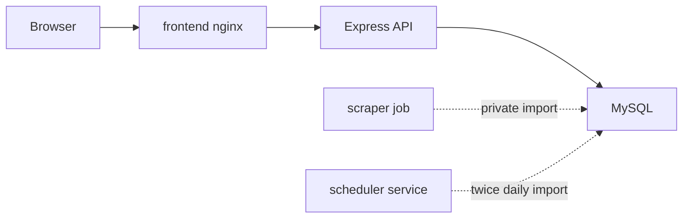

# Portfolio Case Study

## ElonMealsDB

ElonMealsDB is a self-hosted dining planner that turns Elon Dining menu data into a searchable, nutrition-aware React dashboard backed by a normalized MySQL model. It is designed as both a useful campus meal-planning app and a portfolio project that demonstrates SQL, secure backend design, Docker deployment, scraping, and frontend product polish.

## Short Website Summary

Built a Dockerized full-stack dining planner with a React/Vite frontend, Express API, MySQL relational schema, Python scraper, and private scheduled import job. The app supports menu search, imported-date browsing, dietary filters, nutrition insights, nutrition details, favorites, local meal planning, data freshness indicators, and an in-app SQL proof panel while keeping public backend traffic read-only and personal planning data in browser storage.

## Problem

Campus dining data is useful but awkward to explore when menus, nutrition details, meal windows, stations, and dietary flags are spread across web pages. The original project had the right idea, but it needed a cleaner architecture, safer public defaults, repeatable deployment, current scraping behavior, and a UI that looked professional enough to show.

## What I Built

- A normalized MySQL schema for restaurants, meals, stations, foods, station-food relationships, and scraper run metadata.
- A secure read-only Express API with validated inputs, parameterized queries, CORS allowlisting, rate limiting, Helmet, structured errors, and no stack traces in responses.
- A Python scraper/importer that parses current Elon Dining embedded menu/nutrition data and upserts it into MySQL.
- A Docker Compose deployment with frontend, backend, MySQL, private one-shot scraper, and recurring scheduler service.
- A React/Vite dashboard with restaurant/date selection, imported-date browsing, menu tabs, station coverage, food search, dietary/allergen filters, SQL-backed nutrition insights, nutrition drawer, favorites, local meal planning, history, and nutrition goals.
- A System Proof panel that shows normalized data lineage, import status, indexed foods, and SQL-backed API examples from the backend.
- Public-facing docs for architecture, API usage, SQL walkthroughs, deployment, security, and a reviewer demo script.

## Architecture



Personal meal-planning state stays in browser storage. The public backend serves only menu and nutrition data, which keeps the server-side attack surface small and makes the API safe to expose behind a reverse proxy.

## Technical Highlights

### SQL And Data Modeling

- Modeled menu data as relational tables instead of storing page-shaped JSON.
- Joined restaurants, meals, stations, station-food rows, and foods for menu rendering.
- Added aggregate endpoints for coverage, dietary counts, average calories, and top-protein foods.
- Kept scraper run metadata separate from menu facts so data freshness is auditable.
- Included reviewer-ready SQL examples in `docs/sql-walkthrough.md` and in `/api/sql-proof`.

### Backend And Security

- Migrated legacy database access to `mysql2/promise`.
- Used placeholders and named parameters for API SQL.
- Validated route params and query filters with Zod.
- Kept dynamic allergen filters behind a server-side column allowlist.
- Removed public write routes and server-side user/planner mutation paths.
- Split DB credentials into read-only API and writer scraper accounts.
- Added strict request body limits, Helmet, rate limiting, CORS allowlisting, structured errors, and health/readiness endpoints.

### Docker And Operations

- Added Dockerfiles for backend, frontend, and scraper.
- Added Compose services for frontend, backend, MySQL, one-shot scraper, and recurring scraper scheduler.
- Kept MySQL internal-only with a named volume.
- Used non-root runtime users, health checks, dropped Linux capabilities, `no-new-privileges`, and read-only filesystems where practical.
- Added a scheduler service that imports today and tomorrow on configured America/New_York times.

### Frontend Product Work

- Rebuilt the UI as a dense but approachable data app instead of a static class-project interface.
- Added responsive desktop/mobile layouts with accessible controls and real local state.
- Added planner workflows without server-side accounts by using browser-local storage.
- Surfaced imported-date selection and nutrition ranking data directly in the dashboard.
- Added screenshots, e2e coverage, and an in-app System Proof section for technical reviewers.

## Demo Script

1. Start the Docker stack.
2. Open the dashboard and select a service date.
3. Search for a food and open its nutrition drawer.
4. Favorite the food and add it to the meal plan.
5. Show macro totals updating locally.
6. Show imported dates and the Nutrition Insights ranking.
7. Open the System Proof section.
8. Run `/api/sql-proof` and a direct MySQL join from `docs/demo-walkthrough.md`.
9. Show the scraper scheduler logs and `scraper_runs` audit trail.
10. Show the read-only DB user write attempt failing with `ER_TABLEACCESS_DENIED_ERROR`.

Full script: [demo-walkthrough.md](demo-walkthrough.md).

## Screenshots

Desktop:


Mobile:


System proof and import audit trail:


## Verification

Local verification commands used on this branch:

```bash
npm run verify
npm run verify:docker
```

GitHub Actions also runs `node`, `scraper`, and `docker` jobs on pull requests. The Docker job builds images, starts Compose, checks health/API routes, checks malformed JSON handling, and verifies that the backend database user cannot write.

## Resume Bullets

- Re-architected a legacy dining app into a Dockerized React, Express, MySQL, and Python scraper system with a secure read-only public API and private scheduled import path.
- Designed normalized MySQL tables and SQL-backed API endpoints for menu hierarchy, dietary filtering, nutrition ranking, data freshness, and import audit trails.
- Hardened a public self-hosted deployment with least-privilege DB users, request validation, parameterized SQL, rate limiting, security headers, no upload surface, non-root containers, and private Docker networking.

## Links For Reviewers

- [Architecture](architecture.md)
- [SQL walkthrough](sql-walkthrough.md)
- [Demo walkthrough](demo-walkthrough.md)
- [Deployment](deployment.md)
- [Security audit](security-audit.md)
