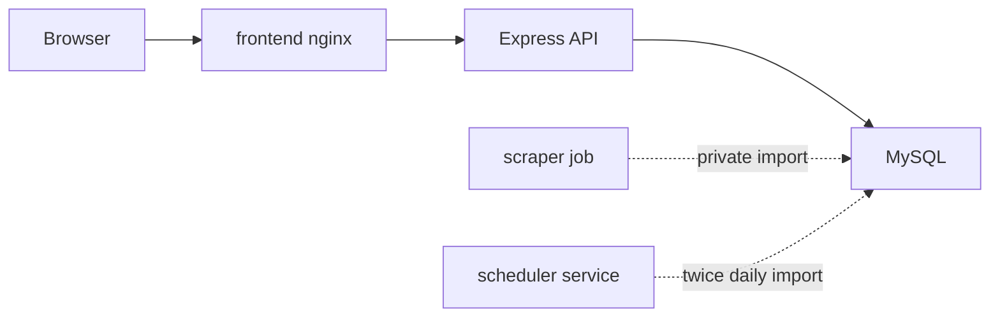

# Portfolio Case Study

## ElonMealsDB

ElonMealsDB is a self-hosted dining planner that turns Elon Dining menu data into a searchable, nutrition-aware React dashboard backed by a normalized MySQL model. I built it because I wanted the project to have real SQL and deployment depth, not just a nice frontend sitting on top of static data.

## Short Website Summary

Built a Dockerized full-stack dining planner with a React/Vite frontend, Express API, MySQL relational schema, Python scraper, and private scheduled import job. The app supports menu search, dietary filters, station filtering, station-level nutrition comparison, nutrition insights, nutrition details, favorites, selected-food planning, CSV export, and browser-local nutrition goals while keeping public backend traffic read-only.

## Problem

Campus dining data is useful but awkward to explore when menus, nutrition details, meal windows, stations, and dietary flags are spread across web pages. The original project had the right idea, but it needed a cleaner architecture, safer public defaults, repeatable deployment, current scraping behavior, and a UI that looked professional enough to show.

## What I Built

- A normalized MySQL schema for restaurants, meals, stations, foods, station-food relationships, and scraper run metadata.
- A secure read-only Express API with validated inputs, parameterized queries, CORS allowlisting, rate limiting, Helmet, structured errors, and no stack traces in responses.
- A Python scraper/importer that parses current Elon Dining embedded menu/nutrition data and upserts it into MySQL.
- A Docker Compose deployment with frontend, backend, MySQL, private one-shot scraper, and recurring scheduler service.
- A React/Vite dashboard with restaurant/date selection, compact top controls, pinned daily nutrition progress, menu tabs, clickable station filters, food search, dietary/allergen filters, SQL-backed nutrition insights, nutrition drawer, favorites, selected-food planning, CSV export, and nutrition goals.
- SQL/API examples in docs and `/api/sql-proof`, kept out of the main product UI so the app still feels like a dining planner.
- A small public docs set for the SQL model, deployment, security notes, and this portfolio writeup.

## Architecture



Personal meal-planning state stays in browser storage. The public backend serves only menu and nutrition data, which keeps the server-side attack surface small and makes the API safe to expose behind a reverse proxy.

## Technical Highlights

### SQL And Data Modeling

- Modeled menu data as relational tables instead of storing page-shaped JSON.
- Joined restaurants, meals, stations, station-food rows, and foods for menu rendering.
- Added aggregate endpoints for coverage, dietary counts, station comparison, average calories, and top-protein foods.
- Distinguished distinct foods from station/meal food appearances in the UI and audit trail.
- Kept scraper run metadata separate from menu facts so data freshness is auditable.
- Included runnable SQL examples in `docs/sql-walkthrough.md` and in `/api/sql-proof`.

### Backend And Security

- Migrated legacy database access to `mysql2/promise`.
- Used placeholders and named parameters for API SQL.
- Validated route params and query filters with Zod.
- Kept dynamic allergen filters behind a server-side column allowlist.
- Removed public write routes and server-side user/planner mutation paths.
- Split DB credentials into read-only API and writer scraper accounts.
- Added strict request body limits, Helmet, rate limiting, CORS allowlisting, structured errors, and health/readiness endpoints.

### Docker And Operations

- Added Dockerfiles for backend, frontend, and scraper.
- Added Compose services for frontend, backend, MySQL, one-shot scraper, and recurring scraper scheduler.
- Kept MySQL internal-only with a named volume.
- Used non-root runtime users, health checks, dropped Linux capabilities, `no-new-privileges`, and read-only filesystems where practical.
- Added a scheduler service that imports today and tomorrow on configured America/New_York times.
- Self-hosted the app as Docker containers behind Caddy and Cloudflare Tunnel, with only the frontend exposed through the reverse proxy.

### Frontend Product Work

- Rebuilt the UI as a dense but approachable data app instead of a static class-project interface.
- Split the React frontend into feature modules for timeline, planner, menu controls, food views, nutrition insights, panels, shared utilities, and scoped stylesheet sections.
- Added responsive desktop/mobile layouts with accessible controls and real local state.
- Added planner workflows without server-side accounts by using browser-local storage.
- Surfaced station filtering, nutrition coverage, station best-fit comparison, and protein-efficiency ranking directly in the dashboard.
- Added screenshots and e2e coverage without turning the product surface into a checklist.

## Demo Path

This is the path I would use in an interview or blog post:

1. Start the Docker stack and open the dashboard.
2. Pick a service date, search for a food, and open the nutrition drawer.
3. Favorite the food, add it to the meal plan, and show macro totals updating locally.
4. Click station chips and show the table filtering by station.
5. Show Nutrition Insights: dietary coverage, station best-fit rows, and protein efficiency.
6. Run `/api/sql-proof` and one direct MySQL query from [sql-walkthrough.md](sql-walkthrough.md).
7. Show the scraper scheduler logs and `scraper_runs` audit trail.
8. Show the read-only DB user write attempt failing with `ER_TABLEACCESS_DENIED_ERROR`.

## Screenshots

Desktop:


Mobile:


## Verification

Local verification commands used before publishing:

```bash
npm run verify
npm run verify:docker
```

GitHub Actions runs `node`, `scraper`, and `docker` jobs on pull requests and pushes. The Docker job builds the images, starts Compose, checks health/API routes, checks malformed JSON handling, and verifies that the backend database user cannot write.

Locally, `npm run verify` covers the code path without needing the full Docker runtime. `npm run verify:docker` is the stronger end-to-end gate when Docker is available.

## Resume Bullets

- Re-architected a legacy dining app into a Dockerized React, Express, MySQL, and Python scraper system with a secure read-only public API and private scheduled import path.
- Designed normalized MySQL tables and SQL-backed API endpoints for menu hierarchy, dietary filtering, nutrition ranking, data freshness, and import audit trails.
- Hardened a public self-hosted deployment with least-privilege DB users, request validation, parameterized SQL, rate limiting, security headers, no upload surface, non-root containers, and private Docker networking.

## Links

- [SQL walkthrough](sql-walkthrough.md)
- [Deployment and security](deployment.md)
