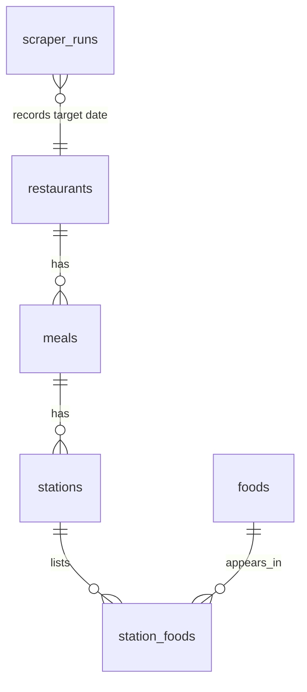

# SQL Walkthrough

This project is intentionally relational: the frontend planner is useful, but the portfolio value is the normalized menu model, SQL-backed API, import audit trail, and least-privilege deployment.

## Schema Shape

The core model separates stable nutrition facts from where a food appears on a specific service date:



Why this matters:

- `foods.external_id` is unique, so imports can update nutrition facts without duplicating food records.
- `station_foods` handles many-to-many appearances: one food can appear at multiple stations or meals.
- `scraper_runs` records operational metadata separately from menu facts, which keeps API freshness auditable.
- Date-scoped tables and indexes let the API answer "what is available today?" without dynamic SQL.

## Run Queries Locally

After `docker compose up`, run an internal MySQL shell with the same read-only account used by the API:

```bash
docker compose exec -T mysql sh -c 'MYSQL_PWD="$MYSQL_API_PASSWORD" mysql -u"$MYSQL_API_USER" "$MYSQL_DATABASE"'
```

The queries below use `2026-07-01`, which is present in the bundled seed data and may be refreshed by live scraper imports.

## Menu Hierarchy Join

This query powers the dashboard's restaurant -> meal -> station -> food hierarchy:

```sql
SELECT
  r.name AS restaurant,
  m.name AS meal,
  s.name AS station,
  f.short_name AS food,
  f.calories,
  f.protein
FROM restaurants r
JOIN meals m ON m.restaurant_id = r.id
JOIN stations s ON s.meal_id = m.id
JOIN station_foods sf ON sf.station_id = s.id
JOIN foods f ON f.id = sf.food_id
WHERE r.service_date = '2026-07-01'
ORDER BY r.name, m.time_open, s.name, f.short_name
LIMIT 10;
```

Review point: this is a five-table join with deterministic ordering and no request-controlled table, column, or sort names.

## Coverage Metrics

This aggregate backs `/api/metrics/coverage` and the dashboard summary cards:

```sql
SELECT
  DATE_FORMAT(r.service_date, '%Y-%m-%d') AS service_date,
  COUNT(DISTINCT r.id) AS restaurants,
  COUNT(DISTINCT m.id) AS meals,
  COUNT(DISTINCT s.id) AS stations,
  COUNT(DISTINCT f.id) AS foods,
  COUNT(DISTINCT CASE WHEN f.vegan THEN f.id END) AS vegan_items,
  COUNT(DISTINCT CASE WHEN f.vegetarian THEN f.id END) AS vegetarian_items,
  COUNT(DISTINCT CASE WHEN f.gluten_free THEN f.id END) AS gluten_free_items
FROM restaurants r
LEFT JOIN meals m ON m.restaurant_id = r.id
LEFT JOIN stations s ON s.meal_id = m.id
LEFT JOIN station_foods sf ON sf.station_id = s.id
LEFT JOIN foods f ON f.id = sf.food_id
WHERE r.service_date = '2026-07-01'
GROUP BY r.service_date;
```

Review point: `COUNT(DISTINCT ...)` prevents over-counting foods that appear in more than one station.

## Nutrition Ranking

This query demonstrates analytical use of the same normalized model:

```sql
SELECT
  f.short_name,
  f.calories,
  f.protein,
  GROUP_CONCAT(DISTINCT s.name ORDER BY s.name SEPARATOR ', ') AS stations
FROM restaurants r
JOIN meals m ON m.restaurant_id = r.id
JOIN stations s ON s.meal_id = m.id
JOIN station_foods sf ON sf.station_id = s.id
JOIN foods f ON f.id = sf.food_id
WHERE r.service_date = '2026-07-01'
GROUP BY f.id
ORDER BY f.protein DESC, f.calories ASC
LIMIT 5;
```

Review point: this is the same data shape a user needs for meal planning, but expressed as a SQL-backed ranking problem.

## Import Freshness And Audit Trail

The scraper and scheduler write every successful import, and scheduled failures are recorded as `failed` rows:

```sql
SELECT
  DATE_FORMAT(target_date, '%Y-%m-%d') AS target_date,
  status,
  restaurants_count,
  meals_count,
  foods_count,
  started_at,
  finished_at,
  error_message
FROM scraper_runs
WHERE target_date = '2026-07-01'
ORDER BY started_at DESC
LIMIT 5;
```

Review point: data freshness is not implied by logs alone; the database can answer when a date was last imported and whether the most recent import failed. `foods_count` here is an import-volume count of food appearances across stations and meals; distinct menu foods are counted with `COUNT(DISTINCT f.id)` in the coverage query.

## Safety Choices

- API queries use `mysql2/promise` placeholders and Zod validation.
- Search text is allowlisted and escaped for `LIKE`.
- Allergen filters map request values to a fixed server-side column allowlist.
- The public backend connects as `MYSQL_API_USER`, which has `SELECT`/`SHOW VIEW` only.
- The scraper and scheduler use `MYSQL_SCRAPER_USER`, which has the write grants needed for imports but is not reachable from public routes.
